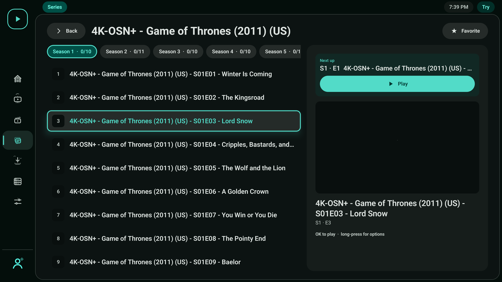
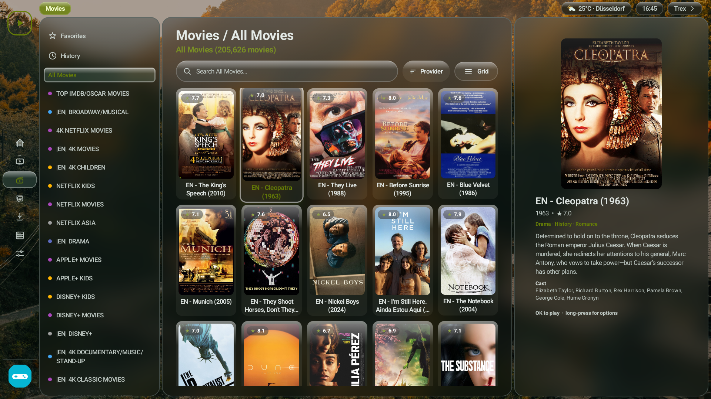
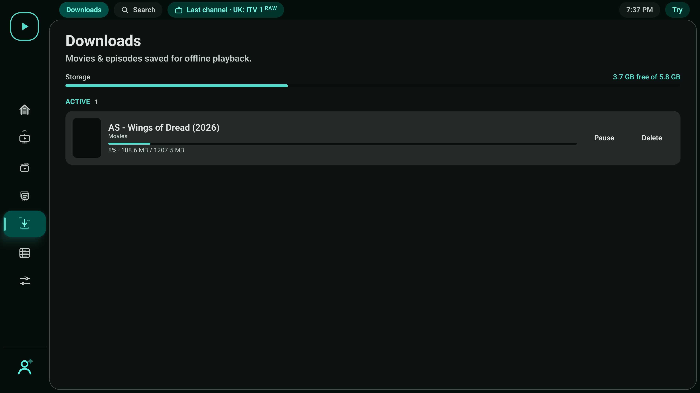
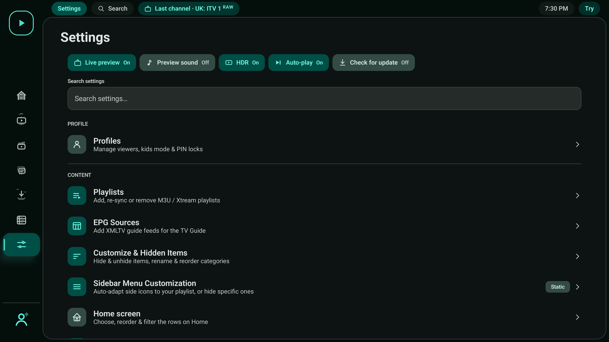

<p align="center">
  
</p>

<p align="center">
  <b>Your own IPTV player for Android TV</b><br>
  <sub>Fast · modern · remote-first — bring your own M3U, Xtream or Stalker (MAC) sources</sub>
</p>

<p align="center">
  
  
  
  
  
  
</p>

<p align="center">
  <a href="https://github.com/ahXN00/OwnTV/actions/workflows/android.yml">
    
  </a>
</p>

---

OwnTV is a native **Android TV** IPTV **player** built with Kotlin, Jetpack Compose for TV, and a
**dual playback engine** — **libmpv (FFmpeg)** for movies/series and maximum compatibility, **ExoPlayer
(Media3)** for near-instant Live TV. It's a *player only* — you bring your own Xtream login, M3U playlist
(by **URL or a local `.m3u`/`.m3u8` file** on the device), or **Stalker/Ministra portal (Portal URL + MAC
address)**, and OwnTV gives you a fast, modern, remote-first way to browse and watch them.

> ⚠️ OwnTV does **not** provide any channels, playlists, subscriptions, streams, or media content.
> You are responsible for adding your own legally accessible sources.

This is an **open-source** project — the code is original (not derived from any other app) and was
**built with the help of AI**. **Contributions are welcome**: clone, build, and test it freely. It
targets **Android TV only** (leanback launcher, D-pad-first UI).

> ### 📖 New here? Read the [**User Guide & Hidden Features →**](extras/USER_GUIDE.md)
> Long‑press to favourite, **Left** for the channel list (**Left** again to browse categories) and
> **Right** for recently watched, the
> MPV/EXO toggle's **compatibility mode**,
> catch‑up from the Guide, startup landing, A/V‑sync — all the remote shortcuts in one place.

---

## 💬 Community

Questions, ideas, bug reports — or just want to follow along? **Join the OwnTV Telegram group:**

### 👉 [t.me/owntvplayer](https://t.me/owntvplayer)

Scan to join from your phone:

<a href="https://t.me/owntvplayer"></a>

---

## ✨ Features

### 🎬 Playback
- **Dual engine** — libmpv (FFmpeg) for max compatibility + ExoPlayer for instant Live TV; per-channel toggle and automatic VOD fallback between them
- Zero-copy **4K HDR** direct rendering · opt-in **auto frame rate** (off by default; 24/25/50/60 fps display matching) · context-aware channel zapping (D-pad/CH± stays in Favorites, History, All or the opened category) · surround sound + 150% volume boost
- **Subtitles** — text (SRT/ASS), image (PGS/VOBSUB/DVB), closed captions, plus OpenSubtitles search & local files with timing adjust; customisable size, colour, position and background transparency
- Resume prompts, next-episode auto-play, mini-player/PiP, **audio-only mode**, and a live codec/resolution/HDR stream-info overlay

### 🧭 Browse
- **Continue Watching** home with TMDB-enriched previews; Live / Movies / Series / Downloads / Guide sections
- Per-profile customizable rows, Favorites & History, bulk rename rules, custom combined categories,
  inline + global search, and a multi-playlist switcher
- **TMDB** posters, plots, cast & trailers **in 40 languages**; scales to ~50k channels / ~168k movies with priority + incremental syncing

### 📥 Sources & EPG
- **Xtream**, **M3U** (typed playlists), and **Stalker/Ministra** MAC portals; add a source from your phone over LAN (QR + PIN)
- XMLTV **TV Guide** grid, **Catch-up TV** (up to 7 days) + live rewind, auto EPG matching, multiple guide sources
- Optional **guide channel logos** — per EPG source, use that feed's own logos instead of your playlist's

### 👥 Profiles & Downloads
- Multiple profiles with own favorites/history/resume, PIN locks, kids flag, "Who's watching?" gate
- Offline movies & episodes — pause/resume/retry, queue groups + storage bar, live poster status strip

### 🎨 Settings & Robustness
- Material 3 theming & accent, **Liquid Glass** frosted look over your own background photo, searchable settings, sidebar/category customization, external player, weather chip
- **Backup & Restore** locally or over Wi-Fi — a single `.own` file carrying your background image, optionally encrypted end to end with your own password (older `.json` backups still restore); in-app updates; memory-safe buffers, no-ANR threading, auto-reconnect, resilient imports & offline detection

📖 Full details: **[player reference →](extras/player.html)** · **[user guide →](extras/USER_GUIDE.md)**

---

## 📸 Screenshots

<table>
  <tr>
    <td align="center"><br><sub>Home — Continue Watching</sub></td>
    <td align="center"><br><sub>Series — episodes</sub></td>
  </tr>
  <tr>
    <td align="center"><br><sub>Live TV — preview playing</sub></td>
    <td align="center"><br><sub>Movies</sub></td>
  </tr>
  <tr>
    <td align="center"><br><sub>"Who's watching?" profile gate</sub></td>
    <td align="center"><br><sub>Downloads</sub></td>
  </tr>
  <tr>
    <td align="center"><br><sub>Settings</sub></td>
    <td align="center"><br><sub>TV Guide (EPG)</sub></td>
  </tr>
</table>

More in **[extras/screenshots/](extras/screenshots/)** — playlist management, EPG & profile settings.

---

## 🧱 Tech stack

| Area | Choice |
|------|--------|
| Language | Kotlin 2.3.10 (AGP 9 **built-in Kotlin**, no `kotlin-android` plugin) |
| Build | AGP 9.2.1 / Gradle 9.4.1, KSP2 2.3.9 |
| UI | Jetpack Compose for TV (`androidx.tv:tv-material` 1.1.0), Compose BOM 2026.05.00 |
| Media | **libmpv** (FFmpeg) — `dev.jdtech.mpv:libmpv` · **ExoPlayer/Media3** (Live TV + image subs) |
| Database | Room 2.8.4 + Paging 3.5.0 + FTS4 (WAL) |
| DI | Koin 4.1.1 |
| Networking | OkHttp |
| Images | Coil 3.3.0 |
| Preferences | DataStore |

`minSdk 26`, `targetSdk 36`, `applicationId tv.own.owntv`.

> **Build note:** Kotlin comes from AGP 9's built-in Kotlin (no `kotlin-android` plugin). KSP 2.3.6+
> supports built-in Kotlin, so Room codegen works alongside it; the Compose compiler and KSP track
> Kotlin 2.3.x.

## ⚙️ How it works (backend)

- **Parsing & sync** — M3U playlists are line-streamed and Xtream `player_api` JSON is read with
  `android.util.JsonReader`, so huge provider payloads are never fully buffered. `SyncManager` does a
  clear-then-insert refresh in ~500-row chunked transactions with Flow progress and cancellation.
- **Storage** — a 27-entity Room schema: profiles & sources (`ProfileSourceCrossRef` for sharing),
  content (categories/channels/movies/series/seasons/episodes), per-profile favorites/history/progress/
  downloads, EPG channels/programmes, external-subtitle cache/selection/timing/links, and FTS4 search
  tables. Totals come from indexed `COUNT` queries.
- **Lists** — Paging 3 with a bounded `maxSize` keeps memory flat across 50k+ item lists.
- **EPG** — bulk XMLTV is stream-parsed (gzip-aware) into a rolling now→+48h window and pruned.
- **Player** — two engines behind a small `PlaybackEngine` interface: **libmpv** (movies/series, and any
  live stream ExoPlayer can't open) and **ExoPlayer/Media3** (Live TV — instant HLS). Live "promotes" the
  running preview straight to full-screen (no reload); the shell hoists the active surface across full ↔
  mini-player. Player state is published as `StateFlow`s for the Compose HUD.
- **DI** — Koin modules (`appModule`, `databaseModule`, `dataModule`, `playerModule`).

### Project layout

```
tv.own.owntv/
├── core/        database (Room), network, parser (M3U/Xtream/XMLTV), stalker (MAC portal), repository, sync, util
├── player/      libmpv + ExoPlayer engines (PlaybackEngine) + Compose surfaces + HUD + mini-player
├── ui/          theme + reusable components (focus surface, cards, state views, avatars)
├── features/    setup, shell, live, movies, series, search, downloads, epg, profiles, settings
└── di/          Koin modules
```

## 📚 Docs & design (`extras/`)

- 📄 **[Complete Feature Document](extras/OwnTV_Complete_Brief_Plan_With_Logo.docx)** — the full
  as-built feature reference: playback, browse, EPG, profiles, architecture, and tech stack.
- 📺 **[Player design reference](extras/player.html)** — an interactive Material 3 mockup of the player UI.
- 🖼️ `extras/logo.png` — the OwnTV logo.

## 📥 Installing (Fire TV / Android TV)

Grab the signed APK from the [**latest release**](https://github.com/ahXN00/OwnTV/releases/latest) and
sideload it. A fixed link always points at the newest signed build:

```
https://github.com/ahXN00/OwnTV/releases/latest/download/OwnTV.apk
```

- **Fire TV** — install the **Downloader** app (by AFTVnews) from the Amazon Appstore, then enter the
  **Downloader code `4308278`** (or [`aftv.news/4308278`](https://aftv.news/4308278), which always
  points at the latest signed `OwnTV.apk`). Enable *Apps from Unknown Sources* if prompted.
- **Android TV / Google TV** — the **Downloader** app is also on Google Play, so the same code
  **`4308278`** works here too. (If Downloader doesn't show in search, open the Play Store on the TV —
  you can reach it via *Settings → Apps → See all apps → Show system apps → Google Play Store* — and
  install it from there.) Or just sideload the APK with your tool of choice (*Send files to TV*, a USB
  drive, or `adb install OwnTV.apk`).

> Only install the APK from this repository's official Releases (or the `…/releases/latest/download/OwnTV.apk`
> link above). It's the build signed by this project's CI — third-party re-hosts aren't endorsed.
>
> Releases ship **two APKs**: `OwnTV-vX.X.X.apk` / `OwnTV.apk` (arm: `arm64-v8a` + `armeabi-v7a` — for
> all real Fire TV / Android TV devices, and what the Downloader code fetches), and
> `OwnTV-x86_64-vX.X.X.apk` (for emulators / rare Intel boxes). Real devices always want the arm build.

## 🛠️ Building & running

> Only needed if you want to build from source. Most people can just **[install the ready-made APK](#-installing-fire-tv--android-tv)** instead — no build tools required.

**What you need first**
- **[Android Studio](https://developer.android.com/studio)** (a recent version that supports AGP 9.x) — this bundles the JDK and Android SDK, so you don't install those separately.
- A build target: either a real **Android TV / Fire TV** device (with USB or wireless debugging turned on), or an **Android TV emulator** created from Android Studio's Device Manager.

**Steps**
1. **Get the code** — click the green **Code** button on GitHub → *Download ZIP* (and unzip it), or run `git clone https://github.com/ahXN00/OwnTV.git`.
2. **Open it** — in Android Studio choose **Open**, pick the project folder, and wait for the first **Gradle sync** to finish (it downloads dependencies; give it a few minutes the first time).
3. **Pick the right build variant** — open **Build Variants** (left sidebar) and choose the flavor that matches your target:
   - **`standard`** — real TV/phone/Fire TV devices and arm emulators (`arm64-v8a` + `armeabi-v7a`)
   - **`x86_64`** — x86_64 emulators only
   - This matters: the native libmpv player only loads on a matching ABI, so the wrong choice = no playback.
4. **Press Run** (▶) with your device/emulator selected. The app installs and launches. It shows up in the **TV launcher** on Android TV, and as a normal app icon on phones/tablets too (minimum **Android 8.0 / API 26**).

**Prefer the command line?** From the project folder run `./gradlew assembleDebug` (use `gradlew.bat assembleDebug` on Windows). The APK lands in `app/build/outputs/apk/`.

**First launch** — you'll go through onboarding: accept the disclaimer, create a profile, then **add a source** (M3U, Xtream, or Stalker/MAC portal) — or import a backup. After it imports, browse from the sidebar and open the **Guide** for the EPG. Everything else is under **Settings**.

**Tested on:** a real **TCL Google TV**, and the **Android Studio emulator** (both the Android TV and Google TV system images).

## 🤝 Contributing

Contributions, bug reports, and ideas are welcome — open an issue or a pull request. Please keep the
project's player-only, bring-your-own-source positioning, and match the existing code style.

## 💛 Support the project

OwnTV is — and will **always be** — completely **free, 100% open-source, and ad-free. Forever.** ❤️ No
paywalls, no "Pro" tier, no catch.

It's a passion project built in my spare time. If it's made your TV a little nicer and you'd like to say
thanks or **buy me a coffee**, a small **PayPal** tip is hugely appreciated — but it's **100% optional**, the
app stays free for everyone no matter what. 🙂

### ☕ [paypal.me/AshiqHasan](https://paypal.me/AshiqHasan)

Scan to donate from your phone:

<a href="https://paypal.me/AshiqHasan"></a>

Thank you for using OwnTV! 🙏

## 🙏 Credits


Movie & series metadata and trailers are provided by [TMDB](https://www.themoviedb.org/).
**This product uses the TMDB API but is not endorsed or certified by TMDB.**


Subtitle search & download is powered by [OpenSubtitles.com](https://www.opensubtitles.com/).
**This product uses the OpenSubtitles API but is not endorsed or certified by OpenSubtitles.** You sign
in with your own OpenSubtitles account and are subject to their terms and download quotas.

### ▶️ Playback engines

- **[mpv](https://mpv.io/)** (via [libmpv](https://github.com/mpv-android/mpv-android), built on
  [FFmpeg](https://ffmpeg.org/)) — the default engine, for the widest IPTV/codec, audio and HDR support.
- **[Media3 / ExoPlayer](https://github.com/androidx/media)** — the fast-start engine for Live TV
  preview and HLS.

### 🧩 Built with

[Jetpack Compose for TV](https://developer.android.com/jetpack/compose) ·
[Room](https://developer.android.com/jetpack/androidx/releases/room) ·
[Koin](https://insert-koin.io/) ·
[OkHttp](https://square.github.io/okhttp/) ·
[Coil](https://coil-kt.github.io/coil/) ·
[ZXing](https://github.com/zxing/zxing) — and the wider Kotlin / AndroidX open-source ecosystem.
Thank you to all their maintainers. See each project for its own license.

## ⚖️ Legal

OwnTV is a media **player** only. It ships with no channels, playlists, subscriptions, or content, and
does not endorse or facilitate access to unauthorized streams. Users are solely responsible for the
sources they add and for complying with the laws and rights that apply to them.

## 📄 License

Released under the **GNU General Public License v3.0 (GPLv3)** — see [LICENSE](LICENSE).

In short: you're free to use, study, modify, and redistribute OwnTV, including commercially — but any
redistributed version (including forks and commercial products built on it) must also be licensed under
GPLv3 and its source made available.

---

<sub>OwnTV is an open-source, player-only project, built with the help of AI.</sub>
